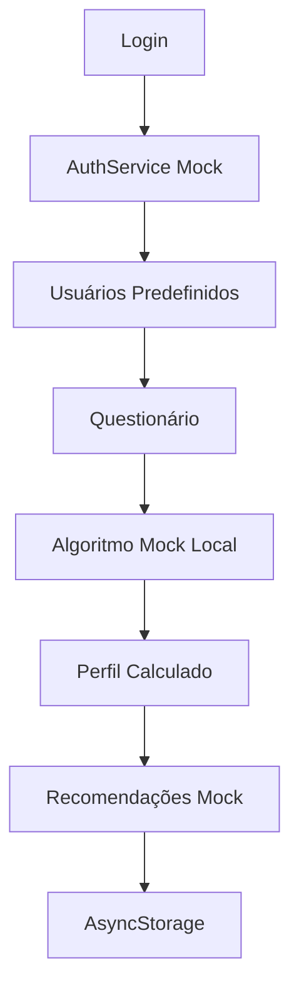
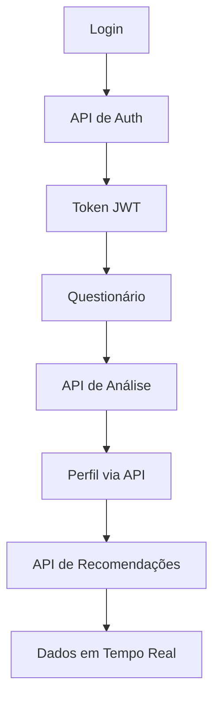

# 📈 Invest Profile - Perfil de Investidor Mobile

> **Aplicativo React Native para análise de perfil de investidor e recomendações personalizadas**

[](https://reactnative.dev/)
[](https://expo.dev/)
[](https://www.typescriptlang.org/)
[](https://tailwindcss.com/)

## 🎯 Sobre o Projeto

O **Invest Profile** é um aplicativo mobile desenvolvido em React Native que permite aos usuários descobrirem seu perfil de investidor através de um questionário personalizado e receberem recomendações de investimentos baseadas em suas preferências, tolerância ao risco e objetivos financeiros.

### ✨ Principais Funcionalidades

- 🔐 **Sistema de Autenticação Completo**
    - Login e registro de usuários
    - Persistência de sessão com AsyncStorage
    - Logout com limpeza de dados

- 📋 **Questionário Inteligente**
    - 8 perguntas sobre perfil de investidor
    - Análise de tolerância ao risco
    - Detecção de interesses ESG
    - Análise de necessidade de liquidez
    - Configuração de valor mensal para investimento

- 📊 **Análise de Perfil**
    - Classificação automática (Conservador, Moderado, Sofisticado)
    - Score de risco personalizado
    - Algoritmos de análise inteligentes
    - Interface visual com ícones e cores por perfil

- 💼 **Recomendações de Investimentos**
    - **Renda Fixa**: CDBs, LCIs, Tesouro Direto
    - **Renda Variável**: Ações recomendadas
    - Dados realistas e atualizados
    - Informações detalhadas de cada investimento

## 🎭 Sistema Mock Avançado

### 🔥 **Atualmente em Modo Mock**

O aplicativo está configurado para funcionar com **dados mockados**, oferecendo uma experiência completa sem dependência de APIs externas. Isso permite:

- ⚡ **Desenvolvimento rápido** sem latência de rede
- 🧪 **Testes consistentes** com dados previsíveis  
- 📱 **Funcionamento offline** completo
- 🎯 **Demonstrações** sem configuração de infraestrutura

### 🎛️ **Configuração Mock vs API Real**

O sistema usa um **toggle centralizado** que permite alternar entre modo mock e APIs reais:

```typescript
// lib/app-config.ts
export const AppConfig = {
  USE_MOCK_DATA: true,  // 🎭 MOCK | false = 🌐 APIs Reais
  
  MOCK_CONFIG: {
    API_DELAY: 1500,    // Simula latência real
    MOCK_USERS: [...],  // Usuários predefinidos
    // ...configurações de mock
  },
  
  API_CONFIG: {
    PROFILE_BASE_URL: "http://54.210.233.65:8080/api/v1",
    RECOMMENDER_BASE_URL: "http://54.210.233.65:8081/api/v1"
    // ...URLs das APIs reais
  }
}
```

### 👥 **Usuários Mock Disponíveis**

Para testar o sistema, use os seguintes usuários predefinidos:

```
📧 admin                    | 🔐 123456
📧 teste@teste.com          | 🔐 teste123  
📧 demo                     | 🔐 demo
```

### 🧠 **Inteligência do Sistema Mock**

#### **Autenticação Mock**
- ✅ Validação contra usuários predefinidos
- ✅ Geração de tokens simulados
- ✅ Persistência de sessão real
- ✅ Simulação de delays de rede

#### **Análise de Perfil Mock**
- ✅ **Algoritmo real** de classificação baseado em respostas
- ✅ Cálculo de score por peso das questões
- ✅ Detecção automática de características (ESG, liquidez)
- ✅ Classificação: Conservador (≤15), Moderado (16-25), Sofisticado (26+)

#### **Recomendações Mock**
- ✅ **25 investimentos de renda fixa** realistas
- ✅ **25 ações brasileiras** com dados de mercado
- ✅ Personalização baseada no perfil calculado
- ✅ Diversificação automática por perfil de risco

## 🏗️ Arquitetura do Projeto

```
invest-profile/
├── 📱 app/                    # Telas e navegação (Expo Router)
│   ├── (auth)/               # Fluxo de autenticação
│   │   ├── login.tsx         # Tela de login
│   │   └── register.tsx      # Tela de registro
│   ├── (tabs)/               # Navegação por abas
│   │   ├── home.tsx          # Tela inicial
│   │   ├── profile.tsx       # Perfil do usuário
│   │   └── recommendations.tsx # Recomendações
│   ├── _layout.tsx           # Layout principal
│   ├── index.tsx             # Tela de boas-vindas + Auth Check
│   └── questionnaire.tsx     # Questionário de perfil
├── 🔧 api/                   # Integrações externas
│   └── investment-api.ts     # APIs de investimentos
├── 📚 lib/                   # Serviços e configurações
│   ├── app-config.ts         # 🎛️ Configuração Mock/API
│   ├── auth-service.ts       # 🔐 Autenticação (Mock + Real)
│   ├── profile-service.ts    # 📊 Gestão de perfil e fluxo
│   ├── mock-data.ts          # 🎭 Dados e algoritmos mock
│   ├── theme.ts              # 🎨 Configurações de tema
│   └── utils.ts              # 🛠️ Utilitários gerais
├── 🎨 components/            # Componentes reutilizáveis
│   └── ui/                   # Componentes de interface
└── 📱 assets/                # Recursos estáticos
```

## 🔄 Fluxo de Dados

### � **Em Modo Mock (Atual)**



1. **Login** → Validação contra usuários mock predefinidos
2. **Questionário** → Coleta respostas e valor mensal  
3. **Análise Local** → Algoritmo calcula perfil baseado em score
4. **Recomendações** → Seleção personalizada da base mock
5. **Persistência** → Dados salvos no AsyncStorage

### 🌐 **Em Modo API Real (Futuro)**



1. **Login** → API de autenticação real
2. **Questionário** → Dados enviados para APIs externas
3. **Análise** → API processa respostas na nuvem
4. **Recomendações** → Dados de mercado em tempo real
5. **Persistência** → Cache local + sincronização

## 🚀 Como Executar

### Pré-requisitos

- Node.js 18+
- npm/yarn/pnpm
- Android Studio (para Android) ou Xcode (para iOS)

### Instalação

```bash
# 1. Clone o repositório
git clone https://github.com/your-username/invest-profile-app.git
cd invest-profile-app

# 2. Instale as dependências
npm install

# 3. Inicie o servidor de desenvolvimento
npm run dev
```

### 📱 Executando no Dispositivo

```bash
# Android
npm run android

# iOS (Mac apenas)  
npm run ios

# Web
npm run web
```

Ou escaneie o QR code com o [Expo Go](https://expo.dev/go) no seu dispositivo.


## 🛠️ Stack Tecnológica

### Core
- **React Native** - Framework mobile
- **Expo** - Plataforma de desenvolvimento
- **TypeScript** - Tipagem estática
- **Expo Router** - Navegação baseada em arquivos

### UI/UX
- **NativeWind** - Tailwind CSS para React Native
- **React Native Reusables** - Componentes UI
- **Lucide React Native** - Ícones
- **Class Variance Authority** - Variantes de componentes

### Estado e Persistência
- **AsyncStorage** - Armazenamento local persistente
- **Custom Services** - Camada de abstração de dados
- **Mock Data Layer** - Sistema inteligente de dados simulados

## 👨‍💻 Autores

- Julia Amorim - RM99609
- Lana Leite - RM551143
- Matheus Cavasini - RM97722

---
